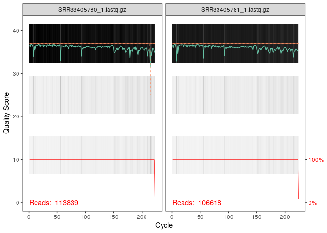
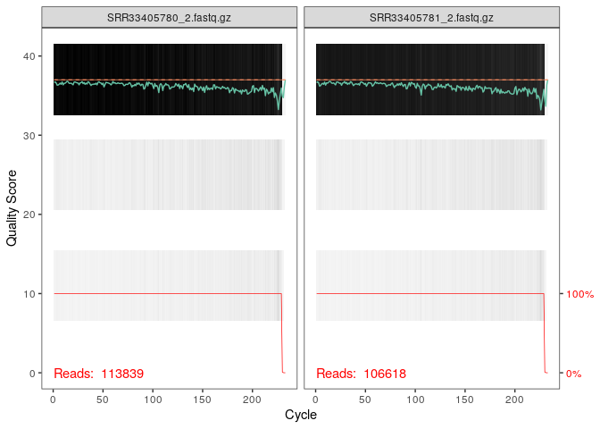
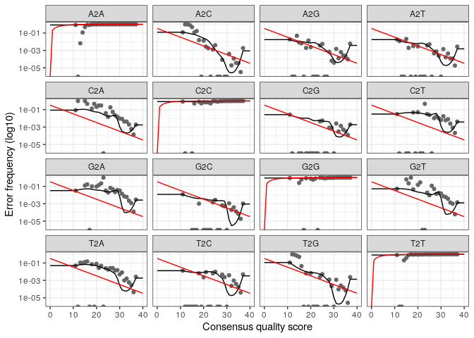
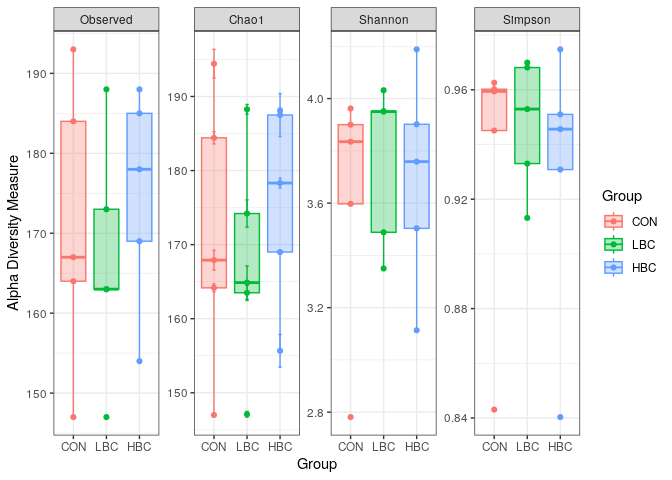
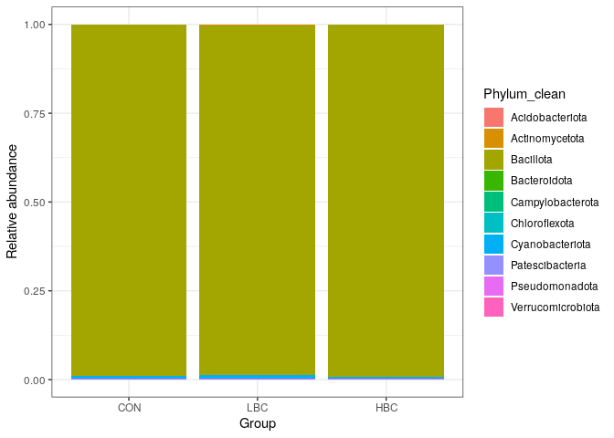
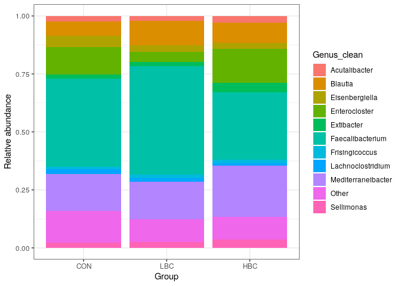
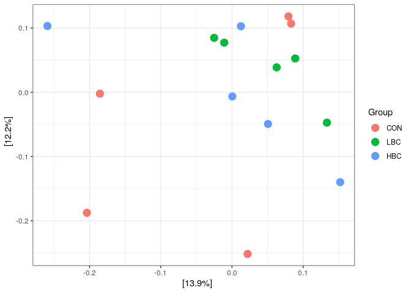
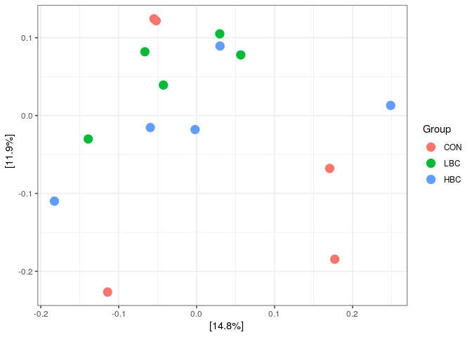
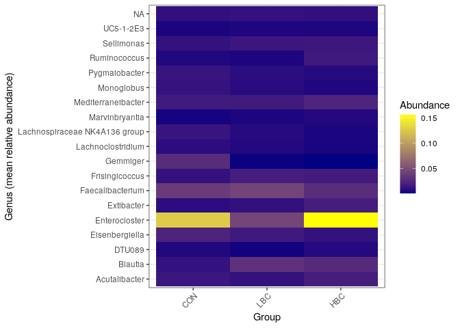
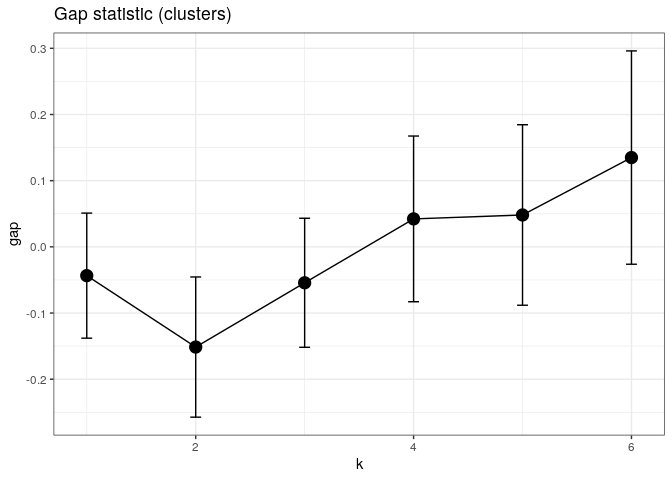

# CC2 ADM Damien Quemener
Analyse de données métabarcode d’un article (Damien Quemener)
================

``` r
library(dada2)
```

    ## Loading required package: Rcpp

``` r
library(Rcpp)
```

``` r
path <- "~/Analyse_Article/Data"
path_trim <- "fastq_trimmed"
dir.create(path_trim, showWarnings = FALSE)
```

``` r
fnFs = sort(
  list.files(path, pattern="_1.fastq",  
                    full.names = TRUE))

fnRs <- sort(list.files(path, pattern="_2.fastq", full.names = TRUE))
## Retrait des amorces 

#Amorce 
FWD <- "ACTCCTACGGGAGGCAGCA"
REV <- "GGACTACHVGGGTWTCTAAT"

fnFs.trim <- file.path(path_trim, basename(fnFs))
fnRs.trim <- file.path(path_trim, basename(fnRs))

cutadapt <- "cutadapt"

for(i in seq_along(fnFs)) {
  system2(cutadapt, args = c(
    "-g", paste0("^", FWD),
    "-G", paste0("^", REV),
    "--discard-untrimmed",
    "-o", fnFs.trim[i],
    "-p", fnRs.trim[i],
    fnFs[i], fnRs[i]
  ))
}
```

``` r
library(ShortRead)
```

    ## Loading required package: BiocGenerics

    ## 
    ## Attaching package: 'BiocGenerics'

    ## The following objects are masked from 'package:stats':
    ## 
    ##     IQR, mad, sd, var, xtabs

    ## The following objects are masked from 'package:base':
    ## 
    ##     anyDuplicated, aperm, append, as.data.frame, basename, cbind,
    ##     colnames, dirname, do.call, duplicated, eval, evalq, Filter, Find,
    ##     get, grep, grepl, intersect, is.unsorted, lapply, Map, mapply,
    ##     match, mget, order, paste, pmax, pmax.int, pmin, pmin.int,
    ##     Position, rank, rbind, Reduce, rownames, sapply, setdiff, sort,
    ##     table, tapply, union, unique, unsplit, which.max, which.min

    ## Loading required package: BiocParallel

    ## Loading required package: Biostrings

    ## Loading required package: S4Vectors

    ## Loading required package: stats4

    ## 
    ## Attaching package: 'S4Vectors'

    ## The following object is masked from 'package:utils':
    ## 
    ##     findMatches

    ## The following objects are masked from 'package:base':
    ## 
    ##     expand.grid, I, unname

    ## Loading required package: IRanges

    ## Loading required package: XVector

    ## Loading required package: GenomeInfoDb

    ## 
    ## Attaching package: 'Biostrings'

    ## The following object is masked from 'package:base':
    ## 
    ##     strsplit

    ## Loading required package: Rsamtools

    ## Loading required package: GenomicRanges

    ## Loading required package: GenomicAlignments

    ## Loading required package: SummarizedExperiment

    ## Loading required package: MatrixGenerics

    ## Loading required package: matrixStats

    ## 
    ## Attaching package: 'MatrixGenerics'

    ## The following objects are masked from 'package:matrixStats':
    ## 
    ##     colAlls, colAnyNAs, colAnys, colAvgsPerRowSet, colCollapse,
    ##     colCounts, colCummaxs, colCummins, colCumprods, colCumsums,
    ##     colDiffs, colIQRDiffs, colIQRs, colLogSumExps, colMadDiffs,
    ##     colMads, colMaxs, colMeans2, colMedians, colMins, colOrderStats,
    ##     colProds, colQuantiles, colRanges, colRanks, colSdDiffs, colSds,
    ##     colSums2, colTabulates, colVarDiffs, colVars, colWeightedMads,
    ##     colWeightedMeans, colWeightedMedians, colWeightedSds,
    ##     colWeightedVars, rowAlls, rowAnyNAs, rowAnys, rowAvgsPerColSet,
    ##     rowCollapse, rowCounts, rowCummaxs, rowCummins, rowCumprods,
    ##     rowCumsums, rowDiffs, rowIQRDiffs, rowIQRs, rowLogSumExps,
    ##     rowMadDiffs, rowMads, rowMaxs, rowMeans2, rowMedians, rowMins,
    ##     rowOrderStats, rowProds, rowQuantiles, rowRanges, rowRanks,
    ##     rowSdDiffs, rowSds, rowSums2, rowTabulates, rowVarDiffs, rowVars,
    ##     rowWeightedMads, rowWeightedMeans, rowWeightedMedians,
    ##     rowWeightedSds, rowWeightedVars

    ## Loading required package: Biobase

    ## Welcome to Bioconductor
    ## 
    ##     Vignettes contain introductory material; view with
    ##     'browseVignettes()'. To cite Bioconductor, see
    ##     'citation("Biobase")', and for packages 'citation("pkgname")'.

    ## 
    ## Attaching package: 'Biobase'

    ## The following object is masked from 'package:MatrixGenerics':
    ## 
    ##     rowMedians

    ## The following objects are masked from 'package:matrixStats':
    ## 
    ##     anyMissing, rowMedians

``` r
sread(readFastq(fnFs.trim[1]))[1:5]
```

    ## DNAStringSet object of length 5:
    ##     width seq
    ## [1]   222 GTGGGGAATATTGGGCAATGGGCGCAAGCCTGAC...TGTAAAGGGAGCGTAGACGGCGAAGCAAGTCCG
    ## [2]   222 GTGGGGAATATTGCACAATGGGGGAAACCCTGAT...TAAAGGGAGCGCAGGCGGGTATGCAAGTTGGGA
    ## [3]   222 GTGGGGAATATTGCACAATGGGGGAAACTCTGAC...GTAAAGGGAGCGTAGGCGGGAAAGCAAGTTGGA
    ## [4]   222 GTGGGGAATATTGCACAATGGGGGAAACCCTGAT...TAAAGGGAGCGCAGGCGGGTAGACAAGTTGGGA
    ## [5]   222 GTGGGGAATATTGGGCAATGGGGGAAACCCTGAC...TAAAGGGCGCGTAGGCGGCCTGGTAAGTTTGAA

Ici, j’ai été obligé de supprimer les amorces car trop de séquence
considérer comme des chimères par la suite.

``` r
sample.names <- sapply(strsplit(basename(fnFs), "_"), `[`, 1)
```

## **Visualisation des profils de qualité de lecture**

### **Qualité de lecture Forward**

``` r
plotQualityProfile(fnFs.trim[1:2])
```

    ## Warning: Removed 102 rows containing missing values or values outside the scale range
    ## (`geom_tile()`).

<!-- -->

On observe une bonne qualité de lecture forward jusqu’à environ 220 pb

## **Qualité de lecture Reverse**

``` r
plotQualityProfile(fnRs.trim[1:2])
```

    ## Warning: Removed 41 rows containing missing values or values outside the scale range
    ## (`geom_tile()`).

<!-- -->

Ici, la qualité de lecture reverse est la même que pour forward, c’est à
dire 220 pb.

## **Filtrer et Rogner**

``` r
filtFs <- file.path(path_trim,"filtered",
                    paste0(sample.names,"_F_filt.fastq.gz"))
filtRs <- file.path(path_trim, "filtered", paste0(sample.names, "_R_filt.fastq.gz"))

names(filtFs) <- sample.names
names(filtRs) <- sample.names
```

### **Filtrage et pré-traitement des séquences**

``` r
out <- filterAndTrim(fnFs.trim, filtFs, 
                     fnRs.trim, filtRs, 
                     truncLen=c(220,220), 
              maxN=0, 
              maxEE=c(2,5),
              truncQ=2, 
              rm.phix=TRUE, 
              compress=TRUE, 
              multithread=FALSE
              )

head(out) 
```

    ##                        reads.in reads.out
    ## SRR33405780_1.fastq.gz   113839    108861
    ## SRR33405781_1.fastq.gz   106618    101764
    ## SRR33405782_1.fastq.gz   105019    100142
    ## SRR33405783_1.fastq.gz   115457    109373
    ## SRR33405784_1.fastq.gz    89066     84419
    ## SRR33405785_1.fastq.gz   120850    115285

Le tableau montre clairement le nombre lectures avant filtrage
(reads.in) et après filtrage (reads.out). Ici, on observe que la
majorité des lectures est conservé (seulement environ 10 000 lectures
filtrée)

## **Taux d’erreur de séquençage**

``` r
errF <- learnErrors(filtFs, multithread=TRUE)
```

    ## 111002980 total bases in 504559 reads from 5 samples will be used for learning the error rates.

``` r
errR <- learnErrors(filtRs, multithread=TRUE)
```

    ## 111002980 total bases in 504559 reads from 5 samples will be used for learning the error rates.

## **Visualisation des taux d’erreur**

``` r
plotErrors(errF, nominalQ=TRUE)
```

    ## Warning in scale_y_log10(): log-10 transformation introduced infinite values.
    ## log-10 transformation introduced infinite values.

<!-- -->

## **Application de l’algo de DADA2**

``` r
dadaFs <- dada(filtFs,
               err=errF, 
               multithread=TRUE 
               )
```

    ## Sample 1 - 108861 reads in 31906 unique sequences.
    ## Sample 2 - 101764 reads in 29675 unique sequences.
    ## Sample 3 - 100142 reads in 25815 unique sequences.
    ## Sample 4 - 109373 reads in 32326 unique sequences.
    ## Sample 5 - 84419 reads in 23543 unique sequences.
    ## Sample 6 - 115285 reads in 32409 unique sequences.
    ## Sample 7 - 105504 reads in 33349 unique sequences.
    ## Sample 8 - 111146 reads in 34371 unique sequences.
    ## Sample 9 - 113181 reads in 33237 unique sequences.
    ## Sample 10 - 106654 reads in 30402 unique sequences.
    ## Sample 11 - 104814 reads in 28021 unique sequences.
    ## Sample 12 - 100645 reads in 29834 unique sequences.
    ## Sample 13 - 88111 reads in 28869 unique sequences.
    ## Sample 14 - 100382 reads in 30312 unique sequences.
    ## Sample 15 - 111291 reads in 26214 unique sequences.

``` r
dadaRs <- dada(filtRs, err=errR, multithread=TRUE)
```

    ## Sample 1 - 108861 reads in 26774 unique sequences.
    ## Sample 2 - 101764 reads in 25527 unique sequences.
    ## Sample 3 - 100142 reads in 22017 unique sequences.
    ## Sample 4 - 109373 reads in 26936 unique sequences.
    ## Sample 5 - 84419 reads in 19878 unique sequences.
    ## Sample 6 - 115285 reads in 28166 unique sequences.
    ## Sample 7 - 105504 reads in 27754 unique sequences.
    ## Sample 8 - 111146 reads in 26849 unique sequences.
    ## Sample 9 - 113181 reads in 28361 unique sequences.
    ## Sample 10 - 106654 reads in 25611 unique sequences.
    ## Sample 11 - 104814 reads in 22788 unique sequences.
    ## Sample 12 - 100645 reads in 27310 unique sequences.
    ## Sample 13 - 88111 reads in 23859 unique sequences.
    ## Sample 14 - 100382 reads in 26859 unique sequences.
    ## Sample 15 - 111291 reads in 22550 unique sequences.

## **Inspection**

``` r
dadaFs[[1]]
```

    ## dada-class: object describing DADA2 denoising results
    ## 915 sequence variants were inferred from 31906 input unique sequences.
    ## Key parameters: OMEGA_A = 1e-40, OMEGA_C = 1e-40, BAND_SIZE = 16

## **Fusion des lectures appariées**

``` r
mergers <- mergePairs(dadaFs, 
                      filtFs, 
                      dadaRs, 
                      filtRs, 
                      verbose=TRUE 
                      )
```

    ## 80129 paired-reads (in 4842 unique pairings) successfully merged out of 103600 (in 18436 pairings) input.

    ## 60991 paired-reads (in 3297 unique pairings) successfully merged out of 96578 (in 16603 pairings) input.

    ## 71924 paired-reads (in 3389 unique pairings) successfully merged out of 95417 (in 14437 pairings) input.

    ## 79068 paired-reads (in 5124 unique pairings) successfully merged out of 103975 (in 18927 pairings) input.

    ## 44351 paired-reads (in 3024 unique pairings) successfully merged out of 80209 (in 14060 pairings) input.

    ## 76068 paired-reads (in 5215 unique pairings) successfully merged out of 108768 (in 20333 pairings) input.

    ## 74223 paired-reads (in 5743 unique pairings) successfully merged out of 99810 (in 20734 pairings) input.

    ## 78351 paired-reads (in 5959 unique pairings) successfully merged out of 105204 (in 20445 pairings) input.

    ## 77873 paired-reads (in 5495 unique pairings) successfully merged out of 107090 (in 20829 pairings) input.

    ## 76845 paired-reads (in 5428 unique pairings) successfully merged out of 101869 (in 18387 pairings) input.

    ## 78182 paired-reads (in 3980 unique pairings) successfully merged out of 100279 (in 14954 pairings) input.

    ## 66724 paired-reads (in 5224 unique pairings) successfully merged out of 95012 (in 19663 pairings) input.

    ## 59461 paired-reads (in 4161 unique pairings) successfully merged out of 83007 (in 17201 pairings) input.

    ## 66912 paired-reads (in 5434 unique pairings) successfully merged out of 95253 (in 19348 pairings) input.

    ## 90151 paired-reads (in 5972 unique pairings) successfully merged out of 107003 (in 15916 pairings) input.

``` r
head(mergers[[1]])
```

    ##                                                                                                                                                                                                                                                                                                                                                                                                                  sequence
    ## 1   GTGGGGAATATTGCACAATGGGGGAAACCCTGATGCAGCGACGCCGCGTGGAGGAAGAAGGTCTTCGGATTGTAAACTCCTGTTGTTGGGGAAAAGAAGGATGGTACCCAACAAGGAAGTGACGGCTAACTACGTGCCAGCAGCCGCGGTAAAACGTAGGTCACGAGCGTTGTCCGGAATTACTGGGTGTAAAGGGAGCGCAGGCGGGTATGCAAGTTGGGAGTGAAATGCATGGGCTCAACCCATGAACTGCTCTCAAAACTGTGTATCTTGAGTAGTGCAGAGGTAGGCGGAATTCCCGGTGTAGCGGTGGAATGCGTAGATATCGGGAGGAACACCAGTGGCGAAGGCGGCCTACTGGGCACCAACTGACGCTGAGGCTCGAAAGTGTGGGTAGCAAACAGG
    ## 2   GTGGGGAATATTGCACAATGGGGGAAACCCTGATGCAGCGACGCCGCGTGGAGGAAGAAGGTCTTCGGATTGTAAACTCCTGTTGTTGGGGAAAAGAAGGATGGTACCCAACAAGGAAGTGACGGCTAACTACGTGCCAGCAGCCGCGGTAAAACGTAGGTCACGAGCGTTGTCCGGAATTACTGGGTGTAAAGGGAGCGCAGGCGGGTATGCAAGTTGGGAGTGAAATACATGGGCTCAACCCATGAACTGCTCTCAAAACTGTGTATCTTGAGTAGTGCAGAGGTAGGCGGAATTCCCGGTGTAGCGGTGGAATGCGTAGATATCGGGAGGAACACCAGTGGCGAAGGCGGCCTACTGGGCACCAACTGACGCTGAGGCTCGAAAGTGTGGGTAGCAAACAGG
    ## 3   GTGGGGAATATTGCACAATGGGGGAAACCCTGATGCAGCGACGCCGCGTGGAGGAAGAAGGTCTTCGGATTGTAAACTCCTGTTGTTGGGGAAAAGAAGGATGGTACCCAACAAGGAAGTGACGGCTAACTACGTGCCAGCAGCCGCGGTAAAACGTAGGTCACGAGCGTTGTCCGGAATTACTGGGTGTAAAGGGAGCGCAGGCGGGTATGCAAGTTGGGAGTGAAATACATGGGCTCAACCCATGAACTGCTCTCAAAACTGTGTATCTTGAGTAGTGCAGAGGTAGGCGGAATTCCCGGTGTAGCGGTGGAATGCGTAGATATCGGGAGGAACACCAGTGGCGAAGGCGGCCTGCTGGGCACCAACTGACGCTGAGGCTCGAAAGTGTGGGTAGCAAACAGG
    ## 4   GTGGGGAATATTGCACAATGGGGGAAACCCTGATGCAGCGACGCCGCGTGGAGGAAGAAGGTCTTCGGATTGTAAACTCCTGTTGTTGGGGAAAAGAAGGATGGTACCCAACAAGGAAGTGACGGCTAACTACGTGCCAGCAGCCGCGGTAAAACGTAGGTCACGAGCGTTGTCCGGAATTACTGGGTGTAAAGGGAGCGCAGGCGGGTATGCAAGTTGGGAGTGAAATGCATGGGCTCAACCCATGAACTGCTCTCAAAACTGTGTATCTTGAGTAGTGCAGAGGTAGGCGGAATTCCCGGTGTAGCGGTGGAATGCGTAGATATCGGGAGGAACACCAGTGGCGAAGGCGGCCTGCTGGGCACCAACTGACGCTGAGGCTCGAAAGTGTGGGTAGCAAACAGG
    ## 5 GTGGGGAATATTGGGCAATGGGCGCAAGCCTGACCCAGCAACGCCGCGTGAAGGAAGAAGGCTTTCGGGTTGTAAACTTCTTTTGTCAGGGACGAACAAATGACGGTACCTGACGAATAAGCCACGGCTAACTACGTGCCAGCAGCCGCGGTAATACGTAGGTGGCAAGCGTTATCCGGATTTATTGGGTGTAAAGGGCGTGTAGGCGGGACTGCAAGTCAGATGTGAAAACCACGGGCTCAACCTGTGGCCTGCATTTGAAACTGTAGTTCTTGAGTGTCGGAGAGGCAATCGGAATTCCGTGTGTAGCGGTGAAATGCGTAGATATACGGAGGAACACCAGTGGCGAAGGCGGATTGCTGGACGATAACTGACGCTGAGGCGCGAAAGCGTGGGGAGCAAACAGG
    ## 6  GTCGGGAATATTGCGCAATGGAGGAAACTCTGACGCAGTGACGCCGCGTATAGGAAGAAGGTCTTCGGATTGTAAACTATTGTCGTTAGGGAAGAGAAAGGACAGTACCTAAGGAGGAAGCTCCGGCTAACTACGTGCCAGCAGCCGCGGTAATACGTAGGGAGCGAGCGTTATCCGGATTTATTGGGTGTAAAGGGTGCGTAGACGGGAGAATAAGTTAGTTGTGAAATCCCTCGGCTTAACTGAGGAACTGCAACTAAAACTATTTTTCTTGAGTGCAGGAGAGGAAAGTGGAATTCCTAGTGTAGCGGTGAAATGCGTAGATATTAGGAGGAACACCAGTGGCGAAGGCGACTTTCTGGACTGTAACTGACGTTGAGGCACGAAAGTGTGGGGAGCAAACAGG
    ##   abundance forward reverse nmatch nmismatch nindel prefer accept
    ## 1      7022       1       1     35         0      0      1   TRUE
    ## 2      3070       1       2     35         0      0      1   TRUE
    ## 3      2896       1       3     35         0      0      1   TRUE
    ## 4      2421       1       4     35         0      0      1   TRUE
    ## 5      1496       4       5     33         0      0      2   TRUE
    ## 6      1171       6      10     34         0      0      2   TRUE

## **Construction d’une table de séquence**

``` r
seqtab <- makeSequenceTable(mergers) 
dim(seqtab)
```

    ## [1]    15 49518

### **Inspection de la distribution des longueurs des séquences**

``` r
table( 
  nchar( 
    getSequences(seqtab) 
        ))
```

    ## 
    ##   229   236   246   249   258   260   272   300   318   337   353   354   356 
    ##     1     1     1     2     1     1     2     1     2     5     2     1     2 
    ##   362   369   370   371   372   373   380   382   387   395   404   405   406 
    ##     1     1    18     1     1     1     1     2     5     1   992 24675  9792 
    ##   407   408   409   410   411   412   413   415   416   417   418   419   421 
    ##  8729  3868    57    27     7     6     5     1     2     5     2     4     4 
    ##   422   423   424   425   426   427   428 
    ##    18    14    96  1126     8     6    20

## **Supprimer les chimères**

Une chimère est une séquence artificielle formée quand 2 fragments d’ADN
s’hybrident partiellement et sont amplifiés comme une “fausse” séquence.

``` r
seqtab.nochim <- removeBimeraDenovo( 
  seqtab, 
  method="consensus", 
  multithread=TRUE, 
  verbose=TRUE 
  ) 
```

    ## Identified 47267 bimeras out of 49518 input sequences.

``` r
dim(seqtab.nochim)
```

    ## [1]   15 2251

## **Proportion de lecture “survivante” au filtrage de chimères**

``` r
sum(seqtab.nochim)/sum(seqtab)
```

    ## [1] 0.5757283

## **Suivre les lectures à travers la pipeline**

``` r
getN <- function(x) sum(getUniques(x)) 

track <- cbind(out, 
               sapply(dadaFs, getN), 
               sapply(dadaRs, getN), 
               sapply(mergers, getN), 
               rowSums(seqtab.nochim) 
               )

colnames(track) <- c("input", "filtered", "denoisedF", "denoisedR", "merged", "nonchim")
rownames(track) <- sample.names

head(track)
```

    ##              input filtered denoisedF denoisedR merged nonchim
    ## SRR33405780 113839   108861    105885    106242  80129   48906
    ## SRR33405781 106618   101764     98985     99043  60991   40378
    ## SRR33405782 105019   100142     97360     97879  71924   48269
    ## SRR33405783 115457   109373    106459    106480  79068   46774
    ## SRR33405784  89066    84419     82035     82273  44351   27651
    ## SRR33405785 120850   115285    111677    111939  76068   40844

## **Attribution d’une taxonomie**

Comparaison des ASVs à une base de données de références pour attribuer
une taxonomie

``` r
taxa <- assignTaxonomy(seqtab.nochim,  "~/Analyse_Article/Data/silva_nr99_v138.2_toGenus_trainset.fa.gz?download=1", 
                       multithread=TRUE 
                       )
```

## **Examination des attributions**

``` r
taxa.print <- taxa 
rownames(taxa.print) <- NULL 
head(taxa.print) 
```

    ##      Kingdom    Phylum         Class         Order            
    ## [1,] "Bacteria" "Bacillota"    "Clostridia"  "Oscillospirales"
    ## [2,] "Bacteria" "Bacillota"    "Clostridia"  "Lachnospirales" 
    ## [3,] "Bacteria" "Bacillota"    "Clostridia"  "Oscillospirales"
    ## [4,] "Bacteria" "Bacteroidota" "Bacteroidia" "Bacteroidales"  
    ## [5,] "Bacteria" "Bacillota"    "Clostridia"  "Oscillospirales"
    ## [6,] "Bacteria" "Bacillota"    "Clostridia"  "Lachnospirales" 
    ##      Family                                  Genus               
    ## [1,] "[Eubacterium] coprostanoligenes group" NA                  
    ## [2,] "Lachnospiraceae"                       "Enterocloster"     
    ## [3,] "Ruminococcaceae"                       "Faecalibacterium"  
    ## [4,] "Rikenellaceae"                         "Alistipes"         
    ## [5,] "Ruminococcaceae"                       "Faecalibacterium"  
    ## [6,] "Lachnospiraceae"                       "Mediterraneibacter"

Ici, on retrouve bien comme dans l’article le phylum majoritaire
Bacillota (anciennement Firmicutes). Néanmoins, les auteurs ont utilisé
le pipeline QIIME2 pour pour l’analyse des séquences et non DADA2, donc
il est fort propable d’avoir des divergences dans la suite de l’analyse
avec PhyloSeq.

## **Package PhyloSeq**

``` r
if(!requireNamespace("BiocManager")){
  install.packages("BiocManager")
}
```

    ## Loading required namespace: BiocManager

``` r
BiocManager::install("phyloseq")
```

    ## 'getOption("repos")' replaces Bioconductor standard repositories, see
    ## 'help("repositories", package = "BiocManager")' for details.
    ## Replacement repositories:
    ##     CRAN: https://packagemanager.posit.co/cran/__linux__/jammy/latest

    ## Bioconductor version 3.17 (BiocManager 1.30.27), R 4.3.1 (2023-06-16)

    ## Warning: package(s) not installed when version(s) same as or greater than current; use
    ##   `force = TRUE` to re-install: 'phyloseq'

    ## Installation paths not writeable, unable to update packages
    ##   path: /usr/local/lib/R/library
    ##   packages:
    ##     boot, class, cluster, codetools, foreign, KernSmooth, lattice, nlme, nnet,
    ##     rpart, spatial, survival

    ## Old packages: 'futile.logger', 'proxy'

``` r
library("phyloseq")
```

    ## 
    ## Attaching package: 'phyloseq'

    ## The following object is masked from 'package:SummarizedExperiment':
    ## 
    ##     distance

    ## The following object is masked from 'package:Biobase':
    ## 
    ##     sampleNames

    ## The following object is masked from 'package:GenomicRanges':
    ## 
    ##     distance

    ## The following object is masked from 'package:IRanges':
    ## 
    ##     distance

``` r
packageVersion("phyloseq")
```

    ## [1] '1.44.0'

``` r
library("ggplot2")
packageVersion("ggplot2")
```

    ## [1] '4.0.1'

``` r
library("scales")
packageVersion("scales")
```

    ## [1] '1.4.0'

``` r
library("grid")
```

    ## 
    ## Attaching package: 'grid'

    ## The following object is masked from 'package:Biostrings':
    ## 
    ##     pattern

``` r
packageVersion("grid")
```

    ## [1] '4.3.1'

### **Documentation intégrée à Phyloseq**

``` r
`?`("phyloseq-package")
`?`(phyloseq)
```

### **Vignette dans le package**

``` r
vignette("phyloseq-basics")
```

    ## starting httpd help server ... done

``` r
vignette("phyloseq-analysis")
```

### **Contruction d’un objet Phyloseq à partir des données DADA2 **

``` r
theme_set(theme_bw())
library(dplyr)
```

    ## 
    ## Attaching package: 'dplyr'

    ## The following object is masked from 'package:ShortRead':
    ## 
    ##     id

    ## The following objects are masked from 'package:GenomicAlignments':
    ## 
    ##     first, last

    ## The following object is masked from 'package:Biobase':
    ## 
    ##     combine

    ## The following object is masked from 'package:matrixStats':
    ## 
    ##     count

    ## The following objects are masked from 'package:GenomicRanges':
    ## 
    ##     intersect, setdiff, union

    ## The following objects are masked from 'package:Biostrings':
    ## 
    ##     collapse, intersect, setdiff, setequal, union

    ## The following object is masked from 'package:GenomeInfoDb':
    ## 
    ##     intersect

    ## The following object is masked from 'package:XVector':
    ## 
    ##     slice

    ## The following objects are masked from 'package:IRanges':
    ## 
    ##     collapse, desc, intersect, setdiff, slice, union

    ## The following objects are masked from 'package:S4Vectors':
    ## 
    ##     first, intersect, rename, setdiff, setequal, union

    ## The following objects are masked from 'package:BiocGenerics':
    ## 
    ##     combine, intersect, setdiff, union

    ## The following objects are masked from 'package:stats':
    ## 
    ##     filter, lag

    ## The following objects are masked from 'package:base':
    ## 
    ##     intersect, setdiff, setequal, union

``` r
meta <- read.csv("SraRunTable.csv", header = TRUE, sep = ",")

rownames(meta) <- meta$Run

meta_phy <- meta %>%
  select(Run, Sample.Name, LibraryLayout, 
          HOST, LibrarySelection, LibrarySource) 
rownames(meta_phy) <- meta_phy$Run
meta_phy$Group <- meta_phy$Sample.Name   

meta_phy$Group <- NA

meta_phy$Group[grepl("^A", meta_phy$Sample.Name)] <- "CON"  
meta_phy$Group[grepl("^B", meta_phy$Sample.Name)] <- "LBC"  
meta_phy$Group[grepl("^C", meta_phy$Sample.Name)] <- "HBC"  

meta_phy$Group <- factor(meta_phy$Group, levels = c("CON", "LBC", "HBC"))

SAMP <- sample_data(meta_phy)

table(meta_phy$Sample.Name, meta_phy$Group)
```

    ##     
    ##      CON LBC HBC
    ##   A1   1   0   0
    ##   A2   1   0   0
    ##   A3   1   0   0
    ##   A4   1   0   0
    ##   A5   1   0   0
    ##   B1   0   1   0
    ##   B2   0   1   0
    ##   B3   0   1   0
    ##   B4   0   1   0
    ##   B5   0   1   0
    ##   C1   0   0   1
    ##   C2   0   0   1
    ##   C3   0   0   1
    ##   C4   0   0   1
    ##   C5   0   0   1

``` r
OTU <- otu_table(seqtab.nochim, taxa_are_rows = FALSE)
TAX <- tax_table(as.matrix(taxa))
stopifnot( all(colnames(seqtab.nochim) == rownames(TAX)) )
stopifnot( all(rownames(SAMP) %in% rownames(seqtab.nochim)) )
```

``` r
ps <- phyloseq(OTU,TAX,SAMP)
ps
```

    ## phyloseq-class experiment-level object
    ## otu_table()   OTU Table:         [ 2251 taxa and 15 samples ]
    ## sample_data() Sample Data:       [ 15 samples by 7 sample variables ]
    ## tax_table()   Taxonomy Table:    [ 2251 taxa by 6 taxonomic ranks ]

``` r
library(phangorn)

## Extraire les séquences 
asv_seqs = getSequences(seqtab.nochim)

## Créer les IDs d’ASV et les mettre en noms de colonnes
asv_ids <- paste0("ASV", seq_along(asv_seqs))
seqtab.nochim.phy = seqtab.nochim
colnames(seqtab.nochim.phy) <- asv_ids

dna_all <- DNAStringSet(asv_seqs)
widths <- width(dna_all)
table(widths)
```

    ## widths
    ## 229 236 246 249 258 260 272 300 318 337 354 356 362 370 371 372 373 387 404 405 
    ##   1   1   1   2   1   1   2   1   2   2   1   2   1   3   1   1   1   1 142 768 
    ## 406 407 408 409 410 411 412 413 415 416 417 418 419 421 422 423 424 425 426 427 
    ## 355 278 382  20  22   6   5   4   1   2   5   2   4   4  16  13  38 136   6   3 
    ## 428 
    ##  14

### **Alpha Diversité**

``` r
library(ggplot2)

p <- plot_richness(ps,
                   x = "Group",
                   measures = c("Observed", "Shannon", "Simpson", "Chao1"),
                   color = "Group")

p + 
  geom_boxplot(aes(fill = Group), alpha = 0.3, outlier.shape = NA) +
  theme_bw()
```

<!-- -->

On observe pas de différence sur la diversité alpha

### **Beta Diversité**

``` r
ord <- ordinate(ps, method = "PCoA", distance = "unifrac")
```

    ## Warning in UniFrac(physeq, ...): Randomly assigning root as -- ASV703 -- in the
    ## phylogenetic tree in the data you provided.

``` r
plot_ordination(ps, ord, color = "Group")
```

<!-- -->

### **Barplots de composition**

``` r
## Phylum + abondance relative
ps_phylum <- tax_glom(ps, taxrank = "Phylum")
ps_phylum_rel <- transform_sample_counts(ps_phylum, function(x) x / sum(x))

## Moyenne par Group × Phylum
dfP <- psmelt(ps_phylum_rel) %>%      # Sample, Group, Phylum, Abundance
  group_by(Group, Phylum) %>%
  summarise(Abundance = mean(Abundance), .groups = "drop")

## Sélection des 10 phyla les plus abondants (globalement)
top_phyla <- dfP %>%
  group_by(Phylum) %>%
  summarise(Abundance = mean(Abundance), .groups = "drop") %>%
  arrange(desc(Abundance)) %>%
  slice_head(n = 10) %>%
  pull(Phylum)

dfP$Phylum_clean <- ifelse(dfP$Phylum %in% top_phyla,
                           as.character(dfP$Phylum),
                           "Other")

## Barplot : une barre par groupe, 10 phyla + Other
ggplot(dfP, aes(x = Group, y = Abundance, fill = Phylum_clean)) +
  geom_bar(stat = "identity", position = "fill") +
  ylab("Relative abundance") +
  theme_bw()
```

<!-- -->

``` r
## Agglomérer au niveau Genre + abondance relative
ps_genus <- tax_glom(ps, taxrank = "Genus")
ps_genus_rel <- transform_sample_counts(ps_genus, function(x) x / sum(x))  

## Extraire et moyenner par Groupe × Genre
dfG <- psmelt(ps_genus_rel) %>%          
  group_by(Group, Genus) %>%
  summarise(Abundance = mean(Abundance), .groups = "drop")

## Garde que les genres les plus abondants
topN <- 10
top_genus <- dfG %>%
  group_by(Genus) %>%
  summarise(Abundance = mean(Abundance), .groups = "drop") %>%
  arrange(desc(Abundance)) %>%
  slice_head(n = topN) %>%
  pull(Genus)

dfG$Genus_clean <- ifelse(dfG$Genus %in% top_genus,
                          as.character(dfG$Genus),
                          "Other")

## Barplot 
ggplot(dfG, aes(x = Group, y = Abundance, fill = Genus_clean)) +
  geom_bar(stat = "identity", position = "fill") +
  ylab("Relative abundance") +
  theme_bw()
```

<!-- -->

Le genre majoritaire est Faecalibacterium ce qui est cohérent avec l'article. Néanmoins, d'autres genre sont identifiés comme abondant 
### **Raréfaction**

``` r
ps.rare <- rarefy_even_depth(ps)
```

    ## You set `rngseed` to FALSE. Make sure you've set & recorded
    ##  the random seed of your session for reproducibility.
    ## See `?set.seed`

    ## ...

    ## 75OTUs were removed because they are no longer 
    ## present in any sample after random subsampling

    ## ...

``` r
## Sans Raréfaction

ord_unrare <- ordinate(ps, method = "PCoA", distance = "unifrac")
```

    ## Warning in UniFrac(physeq, ...): Randomly assigning root as -- ASV439 -- in the
    ## phylogenetic tree in the data you provided.

``` r
plot_ordination(ps, ord_unrare, color = "Group") +
  geom_point(size = 4)
```

<!-- -->

``` r
## Avec Raréfaction

ord_rare <- ordinate(ps.rare, method = "PCoA", distance = "unifrac")
```

    ## Warning in UniFrac(physeq, ...): Randomly assigning root as -- ASV645 -- in the
    ## phylogenetic tree in the data you provided.

``` r
plot_ordination(ps.rare, ord_rare, color = "Group") +
  geom_point(size = 4)
```

<!-- -->

On observe bien qu’avec et sans raréfaction, on voit que les groupe HBC
et LBC sont très proche

### **La heatmap**

``` r
# Garder les 50 taxa les plus abondants
ps_top <- prune_taxa(names(sort(taxa_sums(ps), decreasing = TRUE))[1:50], ps)

# Passer en abondances relatives
ps_rel <- transform_sample_counts(ps_top, function(x) x / sum(x))

# Extraire au format long
df <- psmelt(ps_rel)  # colonnes : Sample, Group, Genus, Abundance, etc.

# Moyenne d'abondance par Group × Genus
df_mean <- df %>%
  group_by(Group, Genus) %>%
  summarise(Abundance = mean(Abundance), .groups = "drop")

ggplot(df_mean, aes(x = Group, y = Genus, fill = Abundance)) +
  geom_tile() +
  scale_fill_gradient(low = "navy", high = "yellow") +
  xlab("Group") +
  ylab("Genus (mean relative abundance)") +
  theme_bw() +
  theme(axis.text.x = element_text(angle = 45, hjust = 1))
```

<!-- -->

“Enterocloster” a une abondance relative bien supérieur aux autres dans
les groupes CON et HBC

### **Statistique d’écart**

``` r
library(cluster)
library(vegan)
```

    ## Loading required package: permute

    ## 
    ## Attaching package: 'vegan'

    ## The following objects are masked from 'package:phangorn':
    ## 
    ##     diversity, treedist

``` r
ord <- ordinate(ps, method = "PCoA", distance = "bray")
x <- ord$vectors
x2 <- x[, 1:2]

pam1 <- function(x, k) list(cluster = pam(x, k, cluster.only = TRUE))

set.seed(123)  
gs <- clusGap(x2,
              FUN   = pam1,
              K.max = 6,   
              B     = 50)  
print(gs, method = "Tibs2001SEmax")
```

    ## Clustering Gap statistic ["clusGap"] from call:
    ## clusGap(x = x2, FUNcluster = pam1, K.max = 6, B = 50)
    ## B=50 simulated reference sets, k = 1..6; spaceH0="scaledPCA"
    ##  --> Number of clusters (method 'Tibs2001SEmax', SE.factor=1): 1
    ##             logW     E.logW         gap     SE.sim
    ## [1,]  0.21845859  0.1749525 -0.04350613 0.09446934
    ## [2,] -0.06945245 -0.2208889 -0.15143643 0.10591954
    ## [3,] -0.52312533 -0.5774425 -0.05431714 0.09749973
    ## [4,] -0.89138850 -0.8491469  0.04224164 0.12518386
    ## [5,] -1.16253692 -1.1143641  0.04817282 0.13637115
    ## [6,] -1.48396723 -1.3490658  0.13490139 0.16115896

Ici, le nombre de cluster recommandé est 1

``` r
## Fonction "wrapper"
gap_statistic_ordination <- function(physeq,
                                     method = "PCoA",
                                     distance = "bray",
                                     FUNcluster = "pam1",
                                     K.max = 6,
                                     axes = 1:2,
                                     B = 50,
                                     verbose = FALSE) {
  ord_phy <- ordinate(physeq, method = method, distance = distance)
  x_2   <- ord_phy$vectors

  if (is.null(axes)) axes <- 1:ncol(x_2)
  x_3   <- x_2[, axes, drop = FALSE]

  if (FUNcluster == "pam1") {
    FUNcluster <- function(x_3, k) list(cluster = pam(x_3, k, cluster.only = TRUE))
  }

  clusGap(x_3, FUN = FUNcluster, K.max = K.max, B = B, verbose = verbose)
}
```

``` r
plot_clusgap <- function(clusgap, title = "Gap statistic (clusters)") {
  library(ggplot2)
  gstab <- data.frame(clusgap$Tab, k = 1:nrow(clusgap$Tab))
  ggplot(gstab, aes(k, gap)) +
    geom_line() +
    geom_point(size = 4) +
    geom_errorbar(aes(ymin = gap - SE.sim, ymax = gap + SE.sim), width = 0.1) +
    ggtitle(title) +
    theme_bw()
}
```

``` r
gap <- gap_statistic_ordination(ps,
                               method   = "PCoA",
                               distance = "bray",
                               K.max    = 6,
                               B        = 50)
print(gap, method = "Tibs2001SEmax")  
```

    ## Clustering Gap statistic ["clusGap"] from call:
    ## clusGap(x = x_3, FUNcluster = FUNcluster, K.max = K.max, B = B, verbose = verbose)
    ## B=50 simulated reference sets, k = 1..6; spaceH0="scaledPCA"
    ##  --> Number of clusters (method 'Tibs2001SEmax', SE.factor=1): 1
    ##             logW     E.logW         gap    SE.sim
    ## [1,]  0.21845859  0.1934631 -0.02499551 0.1025612
    ## [2,] -0.06945245 -0.2058074 -0.13635499 0.1221872
    ## [3,] -0.52312533 -0.5721363 -0.04901100 0.1259239
    ## [4,] -0.89138850 -0.8526790  0.03870950 0.1292941
    ## [5,] -1.16253692 -1.1090601  0.05347682 0.1433906
    ## [6,] -1.48396723 -1.3426463  0.14132091 0.1628891

``` r
plot_clusgap(gs)
```

<!-- -->

On observe ici que les “gaps” sont proche de 0 ou négative ce qui
signifie que le clustering est soit similaire à un nuage aléatoire, soit
qu’il n’est pas plus compact.

### **Conclusion**

Pour conclure, on retrouve ici le même phylum majoritaire, Bacillota (anciennement Firmicutes). En revanche, le DADA2 ainsi que Phyloseq retrouve d'autre genre majoritaire que l'article ne mentionne pas ce qui est du à une autre pipeline utilisée par les auteurs, QIIME2 qui rend l'analyse plus précise que seulement DADA2.
